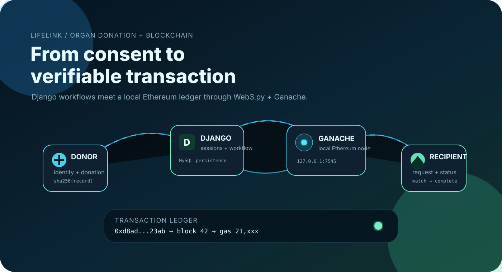
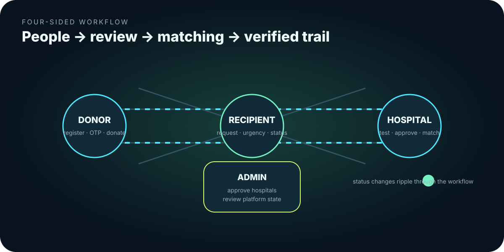
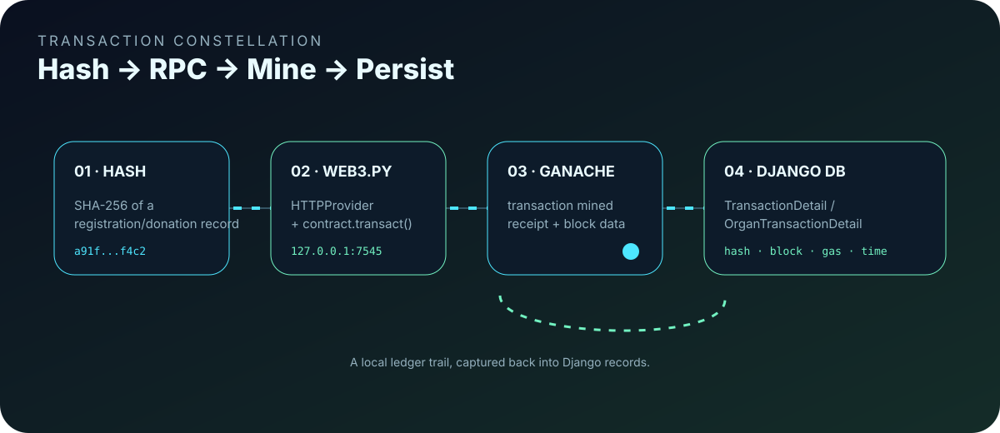
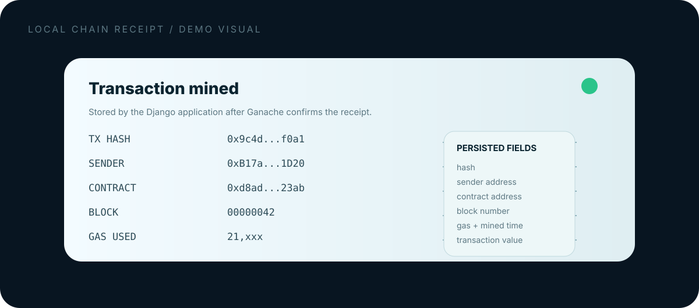

# ⛓️ LIFELINK · BLOCKCHAIN DONATION FRAMEWORK

> ## DONATION WORKFLOW × VERIFIABLE LEDGER
> A Django 5 web platform connecting **donors, recipients, hospitals, and administrators**, with selected workflow events hashed and written to a **local Ethereum/Ganache** network through **Web3.py**.

<p align="center"></p>

<table><tr><td width="25%"><strong>WEB</strong><br/>Django 5.0.5</td><td width="25%"><strong>DATA</strong><br/>MySQL</td><td width="25%"><strong>CHAIN</strong><br/>Ganache + Web3.py</td><td width="25%"><strong>CONTRACT</strong><br/>Solidity 0.8.21</td></tr></table>

> **This README is based on the actual repository and ZIP code, not the older generic blockchain description.**
>
> The current project is **not** a Node/Express + IPFS application. Its runtime is Django + MySQL + Web3.py, with a Truffle/Ganache development setup.

---

## 01 · The system, drawn as a transaction story

```text
 DONOR ─────────────┐
                    │
                    ▼
              Django session
                    │
          ┌─────────┴─────────┐
          ▼                   ▼
     DONATION             ORGAN REQUEST
          │                   │
          │                   ▼
          │                RECIPIENT
          │                   │
          └──────────┬────────┘
                     ▼
                  HOSPITAL
              test / approve
                     │
                     ▼
              MATCH A DONOR
                     │
                     ▼
         SHA-256 record fingerprint
                     │
                     ▼
              Web3.py → Ganache
                     │
                     ▼
            transaction receipt
                     │
                     ▼
            Django transaction row
```

| Surface | Current responsibility |
|---|---|
| **Donor** | registration, OTP verification, donation submission, account/transaction history |
| **Recipient** | registration, OTP verification, organ request, request status |
| **Hospital** | review donors, conduct tests, approve/reject, match/connect donor, inspect chain receipts |
| **Admin** | dashboard counts, hospital approvals, donor and transplant visibility |

<p align="center"></p>

---

## 02 · What is actually on-chain?

The important implementation detail is that the application does **not** store the full medical record on-chain.

Instead, the Python code builds a text representation of selected record fields, creates a SHA-256 digest, and calls a contract method through Web3.py.

### Donation submission path

```text
Donation form
     │
     ▼
Donation model in MySQL
     │
     ▼
concatenate selected donation fields
     │
     ▼
SHA-256 digest
     │
     ▼
contract.transact(...)
     │
     ▼
Ganache receipt
     │
     ▼
TransactionDetail
```

### Donor matching path

```text
Approved donation
       +
Pending organ request
       │
       ▼
Hospital matching view
       │
       ▼
donor connected
       │
       ▼
SHA-256 digest
       │
       ▼
Ganache transaction
       │
       ▼
OrganTransactionDetail
```

<p align="center"></p>

---

## 03 · Smart-contract reality check

The repository contains:

`contracts/HospitalRegistration.sol`

Its Solidity implementation is currently small:

```solidity
contract HospitalRegistration {
    struct Hospital {
        string name;
        address walletAddress;
    }

    Hospital[] public hospitals;

    function registerHospital(string memory name, address walletAddress) public {
        hospitals.push(Hospital(name, walletAddress));
    }

    function getHospitalCount() public view returns (uint) {
        return hospitals.length;
    }
}
```

### Important mismatch in the current code

The Django views call:

```text
contract.functions.storeHashValue(hash_value)
```

but the Solidity contract currently shown in `contracts/HospitalRegistration.sol` exposes:

```text
registerHospital(...)
getHospitalCount()
```

So the repository contains **two competing contract assumptions**:

1. the checked-in Solidity source describes hospital registration;
2. the Django/Web3 integration expects a `storeHashValue` function and a hard-coded deployed contract address.

That should be fixed before presenting this as a fully reproducible blockchain deployment.

---

## 04 · Blockchain receipt panel

The application captures transaction metadata and persists it back into MySQL.

For donations, the model is:

```text
TransactionDetail
├── donation
├── transaction_hash
├── sender_address
├── contract_address
├── gas_used
├── block_number
├── gas_limit
├── mined_on
├── block_hash
└── value
```

For completed recipient matching:

```text
OrganTransactionDetail
├── organ_request
├── hospital
├── transaction_hash
├── sender_address
├── contract_address
├── gas_used
├── block_number
├── gas_limit
├── mined_on
├── block_hash
└── value
```

<p align="center"></p>

---

## 05 · Domain map

```text
Donor
 └── Donation
       └── TransactionDetail

Recipient
 └── OrganRequest
       ├── Hospital
       ├── linked Donation
       └── OrganTransactionDetail

Hospital
 └── approval / testing / matching workflow

Admin
 └── hospital approval + platform views
```

The status machines are intentionally straightforward:

### Donation

```text
Pending
   ↓
Testing
   ↓
Approved ───────► Completed
   │
   └────────────► Rejected
```

### Organ request

```text
pending
   ↓
matched
   ↓
completed
```

Hospitals can review pending/tested donations, approve or reject them, find approved donors for requested organs, then connect a donor to a recipient.

---

## 06 · Technology stack from the source

### Application

- **Python**
- **Django 5.0.5**
- Django templates
- Bootstrap / custom CSS / JavaScript
- Django sessions
- MySQL

### Blockchain

- **Web3.py 6.18.0**
- Ethereum-compatible local network
- **Ganache** at the configured local endpoint
- **Truffle**
- Solidity **0.8.21**

### Supporting pieces

- Pillow for image fields
- SMTP email for OTP / workflow notifications
- SMS integration in the current donor workflow
- Django migrations
- MySQL database dump: `organdonationdatabase.sql`

---

## 07 · Project anatomy

```text
BLOCKCHAIN-DONATION-FRAMEWORK/
├── manage.py
├── requirements.txt
├── truffle-config.js
├── web3_setup.py
├── organdonationproject/
│   ├── settings.py
│   ├── urls.py
│   ├── asgi.py
│   └── wsgi.py
├── donorapp/
│   ├── models.py
│   ├── views.py
│   ├── migrations/
│   └── tests.py
├── recipientapp/
│   ├── models.py
│   ├── views.py
│   ├── migrations/
│   └── tests.py
├── hospitalapp/
│   ├── models.py
│   ├── views.py
│   └── tests.py
├── adminapp/
│   ├── models.py
│   ├── views.py
│   └── tests.py
├── contracts/
│   └── HospitalRegistration.sol
├── build/
│   └── contracts/
├── assets/
│   ├── templates/
│   ├── static/
│   └── readme/
│       ├── blockchain-hero.svg
│       ├── transaction-constellation.svg
│       ├── role-network.svg
│       └── ledger-receipt.svg
├── media/
└── organdonationdatabase.sql
```

---

## 08 · The interface already has a visual library

The ZIP contains a substantial set of project-specific donor/recipient/hospital artwork under:

```text
assets/static/donor/img/
```

That includes campaign banners, medical/organ-donation illustrations, laboratory imagery, recipient visuals, and interface artwork.

<p align="center"></p>

<p align="center"></p>

These are the real assets shipped with the project, so the README uses them instead of inventing unrelated screenshots.

---

## 09 · Local development route

The repository is built around **Django + MySQL + local Ganache**.

### 1. Clone

```bash
git clone https://github.com/Sai-Srinivas-P/BLOCKCHAIN-DONATION-FRAMEWORK.git
cd BLOCKCHAIN-DONATION-FRAMEWORK
```

### 2. Create the environment

```bash
python -m venv .venv
```

Activate the environment, then:

```bash
python -m pip install -r requirements.txt
```

### 3. Prepare MySQL

Create the database expected by the project:

```sql
CREATE DATABASE organdonationdatabase;
```

The repository also includes:

```text
organdonationdatabase.sql
```

for restoring the project database structure/data.

### 4. Start Ganache

The Django/Web3 code expects a local Ethereum JSON-RPC endpoint at:

```text
http://127.0.0.1:7545
```

Start Ganache with the matching port and accounts.

### 5. Compile / deploy the contract

The Truffle configuration targets:

```text
network: development
host: 127.0.0.1
port: 7545
network_id: *
solc: 0.8.21
```

Before running Django, verify that the deployed contract address and ABI used by the Python code match the contract actually deployed.

### 6. Run Django

```bash
python manage.py migrate
python manage.py runserver
```

Then open:

```text
http://127.0.0.1:8000/
```

---

## 10 · Verification checklist

```text
MySQL
  ↓
Django migrations
  ↓
Ganache
  ↓
contract deployed
  ↓
Python Web3 connection succeeds
  ↓
donor / recipient / hospital workflow
  ↓
transaction mined
  ↓
receipt displayed
  ↓
transaction row persisted in MySQL
```

For this repository, the critical smoke test is not simply “the Django home page opens”. The blockchain boundary must also complete a local transaction successfully.

---

## 11 · Security audit notes

This repository has several **development-only security problems** that should be fixed before any public or real-world deployment.

### Secrets in source

The current settings source contains a Django secret key, SMTP credentials, and the donor SMS integration includes an API credential.

**Rotate exposed credentials and move them to environment variables or a secrets manager.**

### Plaintext passwords

The donor, recipient, and hospital models store passwords directly rather than using Django's password hashing framework.

### Weak authentication boundaries

The application uses custom session IDs and manual credential checks rather than Django's built-in authentication flow.

### Hard-coded blockchain configuration

The Web3 endpoint, deployed contract address, and transaction account assumptions are embedded in application code.

### Debug configuration

Development settings include:

```text
DEBUG = True
ALLOWED_HOSTS = []
```

Those values are not production-ready.

### SMS / email integrations

The current notification paths make external network calls directly from views. Those integrations need validation, timeout/error handling, secret management, and rate limiting.

---

## 12 · What this project is really demonstrating

The strongest technical idea here is the **audit trail boundary**:

```text
Application record
       │
       ▼
deterministic fingerprint
       │
       ▼
local Ethereum transaction
       │
       ▼
block / gas / timestamp
       │
       ▼
database transaction record
```

The blockchain acts as a **verification layer for selected workflow events**, while the main application data remains in MySQL.

That is a much more accurate description of the current code than calling the whole system a fully decentralized organ-donation platform.

---

## 13 · Best next engineering moves

```text
1. Rotate committed secrets
          ↓
2. Hash passwords with Django auth
          ↓
3. Replace hard-coded blockchain config
          ↓
4. Align Solidity source + deployed ABI + Python calls
          ↓
5. Add automated tests for Web3 success/failure
          ↓
6. Add authorization checks to every role-sensitive view
          ↓
7. Move external email/SMS calls behind service boundaries
          ↓
8. Add reproducible contract deployment metadata
```

The biggest technical issue to solve first is the **contract integration mismatch**. Until the Solidity source, deployed ABI/address, and Python Web3 calls agree, the blockchain layer is difficult to reproduce reliably.

---

## 📜 License

MIT License. See [`LICENSE`](LICENSE).

## 👤 Author

**Sai-Srinivas-P**  
https://github.com/Sai-Srinivas-P/BLOCKCHAIN-DONATION-FRAMEWORK

---

<p align="center"><strong>⛓️ DONATE · MATCH · VERIFY · RECORD</strong><br/><sub>Django · MySQL · Web3.py · Ganache · Solidity</sub></p>